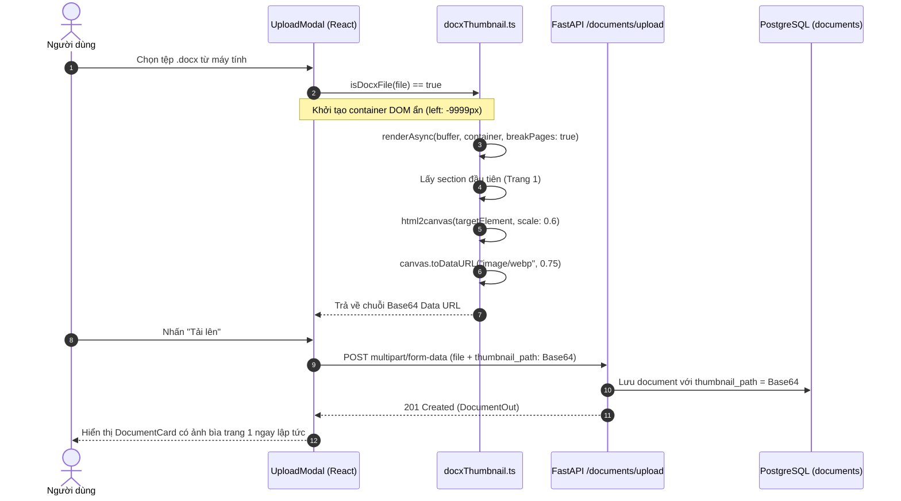
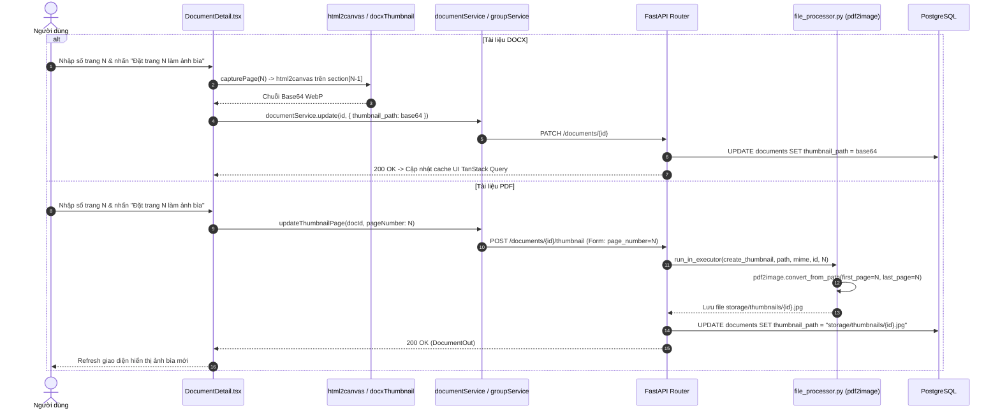
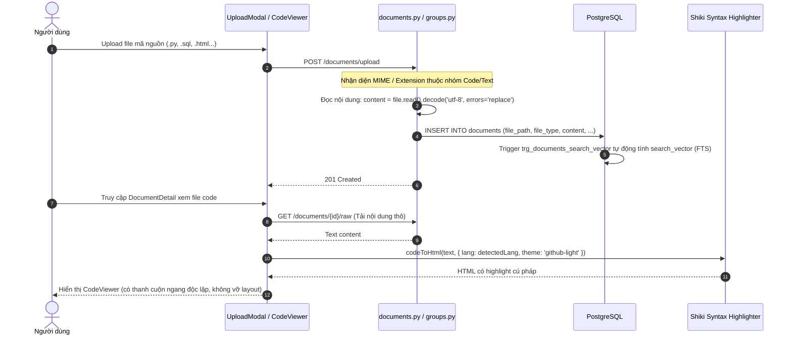

# Đặc Tả Tính Năng: Xem Trước Đa Định Dạng & Tùy Chỉnh Ảnh Bìa (Document Preview & Cover Management)

Tài liệu kỹ thuật chi tiết về tính năng **Xem trước đa định dạng tài liệu** (PDF, DOCX, PPTX, XLSX, Code/Plain Text) và **Hệ thống tạo & tùy chỉnh ảnh bìa (Thumbnail/Cover Management)** trong hệ thống Digital Library, được thực hiện trong hai commits:
- `6d8c155d5605fff5f38e75c231d3e79575eee67f`: Tự động tạo ảnh bìa trang 1 cho tài liệu DOCX khi upload và tùy chỉnh ảnh bìa theo số trang trong `DocumentDetail`.
- `f0898d8a3efd5a5f4d02d845e9c998bc54ddc4ec`: Mở rộng hỗ trợ định dạng bảng tính (.xlsx), trình chiếu (.pptx qua Microsoft Office Web Viewer), hệ thống xem mã nguồn chuyên biệt như GitHub (.py, .html, .sql, .ts...), trích xuất Full-Text Search (FTS) và chọn ảnh bìa linh hoạt cho PDF/Office.

---

## 📑 Mục Lục Điều Hướng

1. [Bối Cảnh & Ý Tưởng Phát Triển (Context & Ideas)](#1-bối-cảnh--ý-tưởng-phát-triển)
2. [Phân Tích Nghiệp Vụ & Yêu Cầu Kỹ Thuật (Analysis)](#2-phân-tích-nghiệp-vụ--yêu-cầu-kỹ-thuật)
3. [Công Nghệ & Thư Viện Sử Dụng (Technology Stack)](#3-công-nghệ--thư-viện-sử-dụng)
4. [Kiến Trúc & Thiết Kế Luồng Hoạt Động (Architecture & Workflows)](#4-kiến-trúc--thiết-kế-luồng-hoạt-động)
5. [Chi Tiết Triển Khai & Cách Thực Hiện (Implementation Steps)](#5-chi-tiết-triển-khai--cách-thực-hiện)
6. [Các Thách Thức Kỹ Thuật Gặp Phải & Giải Pháp (Challenges & Solutions)](#6-các-thách-thức-kỹ-thuật-gặp-phải--giải-pháp)
7. [Danh Mục File Chỉnh Sửa & Vị Trí Code Trọng Tâm (Code Locations)](#7-danh-mục-file-chỉnh-sửa--vị-trí-code-trọng-tâm)
8. [Tài Liệu Chi Tiết Liên Quan](#8-tài-liệu-chi-tiết-liên-quan)

---

## 1. Bối Cảnh & Ý Tưởng Phát Triển

### 1.1. Hiện trạng trước khi triển khai
- **Hạn chế về ảnh bìa (Thumbnails):** Hệ thống ban đầu chỉ hỗ trợ tự động tạo ảnh bìa cho file PDF và file ảnh tĩnh (`image/*`) thông qua tiến trình nền trên Backend (`pdf2image` + `PIL`). Đối với tài liệu Word (`.docx`), hệ thống gán `thumbnail_path = null`, dẫn đến việc các thẻ `FileDocumentCard` và `LocalGroupDocumentCard` chỉ hiển thị biểu tượng icon Word mặc định, giảm tính trực quan khi sinh viên/giảng viên duyệt kho tài liệu.
- **Hạn chế về tính năng tương tác với trang bìa:** Người dùng không có khả năng can thiệp vào ảnh bìa của tài liệu. Nhiều tài liệu PDF/DOCX có trang 1 là trang trắng, trang giới thiệu bản quyền, hoặc trang mục lục sơ sài; trong khi trang 2 hoặc 3 mới là bìa chính thức hoặc chứa nội dung/sơ đồ tiêu biểu.
- **Hạn chế về định dạng hỗ trợ:** Hệ thống chỉ chấp nhận upload PDF, Word và Image. Các tài liệu bài giảng trình chiếu (`.pptx`), bảng tính số liệu (`.xlsx`) và đặc biệt là các tệp **mã nguồn/script học tập** (`.py`, `.sql`, `.cpp`, `.java`, `.html`, `.sh`...) chưa được hỗ trợ lưu trữ, phân loại hay tìm kiếm.
- **Trải nghiệm xem trước (Preview UX):** Các file code chỉ có thể xem dưới dạng plain text hoặc file Markdown thô, không có chức năng xem code chuẩn chỉnh (syntax highlighting, line numbers, font mono, theme sáng/tối) như giao diện GitHub. Đồng thời, các dòng code dài làm vỡ layout giao diện do tràn chiều ngang (`horizontal overflow`).

### 1.2. Ý tưởng giải pháp
1. **Client-side Thumbnail Rendering cho DOCX:** Thay vì cài đặt phần mềm nặng như LibreOffice trên Server để chuyển DOCX sang PDF rồi chụp ảnh (gây tốn RAM, CPU và tăng độ trễ server), giải pháp đưa việc render và chụp ảnh DOCX về phía **Frontend** bằng cách kết hợp `docx-preview` và `html2canvas`, xuất ảnh nén WebP Base64 (~20-30KB) gửi thẳng lên database.
2. **Cho phép tùy biến chọn số trang làm ảnh bìa:**
   - Với **DOCX**: Cho phép người dùng duyệt số section/trang trực tiếp trên frontend, bấm "Đặt trang X làm ảnh bìa" -> chụp canvas trang tương ứng và cập nhật.
   - Với **PDF**: Cung cấp API chuyên biệt cho phép Backend dùng `pdf2image` render chính xác trang $N$ mà người dùng chọn để làm ảnh đại diện mới.
   - Với **PPTX, XLSX và các định dạng khác**: Cung cấp nút upload ảnh bìa thủ công (Custom Cover Upload) tiện lợi.
3. **Mở rộng kho tài liệu số cho sinh viên Công nghệ thông tin (Code as Document):**
   - Hỗ trợ hơn 40 định dạng mã nguồn phổ biến (`.py`, `.js`, `.ts`, `.cpp`, `.sql`, `.html`, `.css`, `.json`...).
   - Tích hợp tự nhiên với tính năng **Bundle**: Một gói bài học có thể gồm PDF giáo trình lý thuyết + file code thực hành + script database SQL.
   - **Full-Text Search (FTS) tự động**: Đọc nội dung code vào cột `documents.content` ngay khi upload và đồng bộ hóa qua Trigger PostgreSQL để người dùng có thể tìm kiếm theo tên hàm, biến, comment trong code.
4. **Viewer chuyên nghiệp:**
   - Tích hợp **Shiki** để render mã nguồn với theme `github-light`, định dạng chuẩn responsive có thanh cuộn ngang độc lập.
   - Tích hợp **Microsoft Office Web Viewer** qua `@cyntler/react-doc-viewer` để xem trước trực tiếp file `.pptx` và `.xlsx`.

---

## 2. Phân Tích Nghiệp Vụ & Yêu Cầu Kỹ Thuật

### 2.1. Phân loại định dạng tài liệu (MIME & Extension Groups)
Hệ thống chuẩn hóa phân loại tài liệu thành 6 nhóm danh mục:

| Nhóm (File Group) | Các định dạng đại diện | Cơ chế Preview | Cơ chế tạo & chọn ảnh bìa |
| :--- | :--- | :--- | :--- |
| **PDF** | `.pdf` | Thẻ `<iframe>` nhúng trình đọc PDF của trình duyệt | Tự động trang 1 bằng `pdf2image` ở backend; cho phép đổi sang trang $N$ tùy ý |
| **DOCX** | `.docx`, `.doc` | `docx-preview` render DOM động trên Frontend | Tự động render ẩn trang 1 thành WebP Base64 khi upload; cho phép chọn trang $N$ trong viewer |
| **Office (Slide & Sheet)** | `.pptx`, `.ppt`, `.xlsx`, `.xls` | `@cyntler/react-doc-viewer` (Microsoft Office Online Web Viewer) | Nút upload ảnh bìa tùy chỉnh từ máy tính |
| **Code / Plain Text** | `.py`, `.js`, `.ts`, `.cpp`, `.java`, `.sql`, `.html`, `.css`, `.sh`, `.json`, `.yaml`, `.md`... (hơn 40 đuôi) | Sub-component `CodeViewer` (Shiki highlight) + tab Markdown Viewer | Sử dụng icon ngôn ngữ mặc định; hỗ trợ nút upload ảnh bìa thủ công |
| **Hình ảnh** | `.png`, `.jpg`, `.jpeg`, `.webp`, `.gif`, `.svg` | Thẻ `` responsive với lazy loading | Thu nhỏ giữ tỉ lệ (resize thumbnail 800x800) |
| **Bundle / Gói tài liệu** | `application/bundle` | Danh sách cây thư mục (Tree List) | Hiển thị icon bundle chuyên biệt |

### 2.2. Yêu cầu phi chức năng (Non-Functional Requirements)
- **Hiệu năng & Kích thước dữ liệu:**
  - Thumbnail Base64 cho DOCX xuất ra định dạng `image/webp` với chất lượng `0.75` và tỷ lệ scale `0.6` nhằm giữ dung lượng mỗi chuỗi Base64 dao động trong khoảng 20KB - 35KB, không gây phình to cơ sở dữ liệu.
  - Quá trình đọc nội dung file code phục vụ FTS giới hạn an toàn tối đa 2.000.000 ký tự để tránh tràn bộ nhớ server khi gặp các file dataset dạng plain text lớn.
- **Trải nghiệm người dùng (UX):**
  - Không chặn luồng UI (Non-blocking): Thao tác chụp ảnh DOCX hoặc render PDF chạy bất đồng bộ với trạng thái loading spinner (`Loader2`) rõ ràng.
  - Phân trang & Điều hướng: Thêm tab bộ lọc **"Code mẫu"** (`code`) trên thanh tab danh sách tài liệu (`DocumentTypeTabs`) và `DocumentBrowser`.

---

## 3. Công Nghệ & Thư Viện Sử Dụng

### 3.1. Frontend Stack
- **`docx-preview` (v0.4.1):** Thư viện phân tích định dạng OOXML (Word `.docx`) và render thành các phần tử HTML (`<section>`, `<p>`, `<table>`) ngay trong DOM của trình duyệt.
- **`html2canvas` (v1.4.1):** Chụp màn hình phần tử DOM HTML (DOM node của trang DOCX) và chuyển đổi thành HTML5 Canvas đối tượng đồ họa.
- **`@cyntler/react-doc-viewer` (v0.1.14):** Trình xem tài liệu đa năng cho React, tích hợp sẵn các renderer của Microsoft Office Web Viewer (Office Online Frame) cho PPTX và XLSX.
- **`shiki` (v4.5.0):** Công cụ highlight cú pháp mã nguồn dựa trên TextMate grammar (tương tự VS Code), hỗ trợ định dạng tĩnh cực nhanh với theme `github-light`.
- **`react-markdown` & `remark-gfm`:** Hiển thị tài liệu ở chế độ văn bản Markdown cấu trúc sạch.
- **`lucide-react`:** Bộ icon giao diện (Camera, Code2, FileSpreadsheet, Presentation, Loader2...).

### 3.2. Backend Stack
- **FastAPI (Python 3.11+):** Framework Web Async xử lý upload đa phần (multipart/form-data), background worker tasks, và streaming raw content.
- **PostgreSQL 15+ & SQLAlchemy Async ORM:**
  - Cột `thumbnail_path`: Lưu trữ linh hoạt cả URL tương đối (`storage/thumbnails/...`) lẫn chuỗi WebP Data URL (`data:image/webp;base64,...`) nhờ kiểu `TEXT`.
  - Cột `search_vector`: Kiểu dữ liệu `tsvector` được tự động cập nhật bởi Trigger PL/pgSQL khi có thay đổi trên `title` và `content`.
- **`pdf2image` & `poppler-utils`:** Thư viện Python bọc công cụ Poppler, trích xuất chính xác trang $N$ của file PDF thành ảnh JPEG chuẩn màu RGB.
- **`pygments`:** Thư viện nhận diện cú pháp mã nguồn phía server (`guess_lexer_for_filename`, `guess_lexer`) phục vụ việc tự động bọc code block khi chuyển đổi sang Markdown.

---

## 4. Kiến Trúc & Thiết Kế Luồng Hoạt Động

### 4.1. Luồng 1: Tự Động Tạo Ảnh Bìa DOCX Khi Upload



---

### 4.2. Luồng 2: Tùy Chỉnh Chọn Trang Làm Bìa Cho PDF & DOCX Trong DocumentDetail



---

### 4.3. Luồng 3: Upload & Xem Trước File Code (Code as Document)



---

## 5. Chi Tiết Triển Khai & Cách Thực Hiện

### 5.1. Triển khai Module Thumbnail DOCX phía Frontend
- **Tạo hàm tiện ích `docxThumbnail.ts`:**
  - Tạo container ẩn với tọa độ `position: fixed; left: -9999px; width: 800px; background: #ffffff`.
  - Sử dụng `renderAsync(buffer, container, undefined, { inWrapper: true, breakPages: true })`. Tùy chọn `breakPages: true` là chìa khóa để `docx-preview` phân chia tài liệu thành từng thẻ `<section className="docx-preview-wrapper">` tương ứng với từng trang văn bản.
  - Sử dụng `html2canvas` để chụp section được chỉ định:
    ```typescript
    const canvas = await html2canvas(targetElement, {
      scale: 0.6,
      useCORS: true,
      logging: false,
      backgroundColor: "#ffffff",
    });
    return canvas.toDataURL("image/webp", 0.75);
    ```
  - Luôn đảm bảo dọn dẹp DOM node trong khối `finally { container.remove(); }` để ngăn ngừa rò rỉ bộ nhớ (memory leaks).
- **Hàm chuẩn hóa URL ảnh đại diện `getThumbnailUrl.ts`:**
  - Nhận diện linh hoạt: Nếu chuỗi bắt đầu bằng `data:` (Base64 data URI) hoặc `http://`, `https://` thì giữ nguyên; nếu là đường dẫn tương đối server (`storage/thumbnails/...`) thì ghép với tiền tố `VITE_API_URL`.

### 5.2. Nâng cấp Cơ sở dữ liệu & Model
- **Chuyển đổi kiểu dữ liệu `thumbnail_path`:**
  - Trong `backend/app/models/document.py`, đổi `thumbnail_path` từ `String(1024)` thành `Text`.
  - Kiểu `Text` trong PostgreSQL cho phép lưu trữ chuỗi văn bản không giới hạn độ dài, chứa vừa vặn toàn bộ chuỗi Base64 Data URL (~30KB) mà không cần lưu file trung gian trên ổ đĩa.
- **Khôi phục Trigger Full-Text Search (FTS):**
  - Tạo script Alembic `restore_fts_search_vector_trigger.py` và file `backend/apply_fts.py`.
  - Định nghĩa hàm trigger PL/pgSQL gán trọng số: Trọng số **A** cho tiêu đề (`title`) và trọng số **B** cho toàn bộ nội dung code/text (`content`).

### 5.3. Xây dựng API Cập nhật Trang Bìa PDF
- **Backend:**
  - `POST /documents/{document_id}/thumbnail` (dành cho tài liệu cá nhân).
  - `POST /groups/{group_id}/documents/{document_id}/thumbnail` (dành cho tài liệu nhóm, có kiểm tra quyền hạn `require_full_permission`).
  - Hàm xử lý nhận `page_number: int = Form(1)`. Để tránh chặn Event Loop bất đồng bộ của FastAPI do `pdf2image` thực hiện render I/O nặng, hàm được thực thi thông qua executor:
    ```python
    loop = asyncio.get_event_loop()
    thumbnail_path = await loop.run_in_executor(
        None, create_thumbnail, document.file_path, document.file_type, document.id, page_number
    )
    ```
- **Frontend Services:**
  - Bổ sung `updateThumbnailPage` vào cả `documentService.ts` và `groupService.ts` gửi `FormData` chứa `page_number`.

### 5.4. Xây dựng Giao diện Xem Trước Đa Định Dạng trong `DocumentDetail.tsx`
- **Sub-component `DocxViewer`:**
  - Render tài liệu bằng `docx-preview`.
  - Đếm tổng số section: `setTotalPages(containerRef.current.querySelectorAll("section").length)`.
  - Cung cấp input chọn trang và nút bấm chụp trang bìa.
- **Sub-component `PdfViewer`:**
  - Hiển thị tài liệu trong `<iframe>`.
  - Cung cấp thanh công cụ chọn trang bìa với nút `Camera`, gọi mutation `updateThumbnailPageMutation`.
- **Sub-component `CodeViewer`:**
  - Tải mã nguồn gốc qua endpoint `/documents/{id}/raw`.
  - Ánh xạ phần mở rộng file (extension) sang ngôn ngữ tương ứng trong Shiki (`py` -> `python`, `ts` -> `typescript`, `sql` -> `sql`, `dockerfile` -> `dockerfile`...).
  - Dùng `shiki.codeToHtml(text, { lang, theme: 'github-light' })`.
  - Bọc trong thẻ div có kiểu `max-w-full overflow-hidden` và phần tử con `overflow-auto custom-scrollbar` để xử lý mượt mà các dòng code dài mà không đẩy giãn chiều rộng trang.
- **Tích hợp `@cyntler/react-doc-viewer`:**
  - Xử lý các tài liệu `.pptx` và `.xlsx` bằng cách nhúng trình xem trực quan.
  - Cung cấp nút **"Tải lên ảnh bìa"** thủ công cho phép chọn ảnh từ máy để chuyển thành Base64 và cập nhật vào document.

---

## 6. Các Thách Thức Kỹ Thuật Gặp Phải & Giải Pháp

### Thách thức 1: Giới hạn độ dài chuỗi lưu trữ Thumbnail
- **Vấn đề:** Khi gửi chuỗi Base64 từ frontend lên backend, hệ thống báo lỗi cơ sở dữ liệu `string data, right truncation` do cột `thumbnail_path` ban đầu chỉ là `VARCHAR(1024)`.
- **Giải pháp:** Cập nhật ORM model `Document.thumbnail_path` thành `Mapped[Optional[str]] = mapped_column(Text)`. Kiểu `TEXT` trong PostgreSQL lưu trữ chuỗi độ dài lớn tối ưu (TOAST mechanism), hoàn toàn đáp ứng chuỗi WebP Base64 ~30KB mà không làm chậm các truy vấn thông thường.

### Thách thức 2: Background Task ghi đè mất Thumbnail Base64 vừa upload
- **Vấn đề:** Khi upload DOCX, frontend đã gửi chuỗi Base64 thành công vào database. Tuy nhiên, sau đó tiến trình nền `_process_document_background` kích hoạt, hàm `create_thumbnail()` trả về `None` (vì backend không hỗ trợ render DOCX), và câu lệnh `doc.thumbnail_path = thumbnail_path` đã vô tình ghi đè `None` lên ảnh bìa Base64 vừa lưu!
- **Giải pháp:** Điều chỉnh điều kiện cập nhật trong background task:
  ```python
  # Chỉ ghi đè nếu hàm create_thumbnail thực sự sinh ra đường dẫn mới
  if thumbnail_path:
      doc.thumbnail_path = thumbnail_path
  ```

### Thách thức 3: Trình duyệt nhận diện sai MIME Type của file Code
- **Vấn đề:** Khi người dùng chọn upload file code (như `.sql`, `.ts`, `.py`, `.env`), nhiều trình duyệt trên Windows/macOS gán `file.type = ""` (chuỗi rỗng) hoặc `application/octet-stream`. Điều này khiến hàm xác thực file trong `UploadModal` chặn file với thông báo "Định dạng file không được hỗ trợ".
- **Giải pháp:** Điều chỉnh bộ lọc kiểm tra:
  ```typescript
  const invalid = newFiles.find((f) => {
    const isAcceptedMime = ACCEPTED_MIME.includes(f.type);
    const isAcceptedExt = ACCEPTED_MIME.some(ext => ext.startsWith('.') && f.name.toLowerCase().endsWith(ext));
    // Cho phép file nếu MIME hợp lệ HOẶC đuôi file hợp lệ HOẶC MIME rỗng nhưng đuôi file thuộc danh sách
    return !isAcceptedMime && !isAcceptedExt && f.type !== "";
  });
  ```

### Thách thức 4: Lỗi tràn giao diện (UI Overflow) do dòng Code quá dài
- **Vấn đề:** Trong các file `.html`, minified JS hoặc SQL dài dòng không ngắt dòng, phần tử `<pre><code>` của Shiki mở rộng vô hạn theo chiều ngang, làm toàn bộ khung `DocumentDetail` bị kéo dãn ra khỏi màn hình, mất tính thẩm mỹ và ẩn các nút thao tác bên phải.
- **Giải pháp:** Thiết lập cấu trúc CSS 2 lớp:
  - Khung cha: `w-full max-w-full overflow-hidden`.
  - Khung con hiển thị nội dung: `w-full h-full overflow-auto custom-scrollbar [&>pre]:!bg-transparent`.
  - Nhờ vậy, người dùng có thể cuộn ngang mượt mà để xem các dòng code dài mà bố cục trang vẫn giữ nguyên kích thước chuẩn.

### Thách thức 5: Ưu tiên chế độ xem mặc định cho file Code
- **Vấn đề:** Người dùng cài đặt `defaultPreviewMode = "markdown"` trong Settings. Khi mở file code (`.py`, `.html`), hệ thống ưu tiên mở bản Markdown sinh từ Firecrawl thay vì mở bản xem code GitHub của `CodeViewer`.
- **Giải pháp:** Bổ sung điều kiện kiểm tra `!isCode`:
  ```typescript
  const [viewMode, setViewMode] = useState<"original" | "markdown">(
    hasMarkdown && !isCode && (isPptx || isXlsx || defaultPreviewMode === "markdown") 
      ? "markdown" 
      : "original"
  );
  ```
  Nhờ đó, file code luôn luôn ưu tiên hiển thị ở chế độ gốc với giao diện CodeViewer.

---

## 7. Danh Mục File Chỉnh Sửa & Vị Trí Code Trọng Tâm

### 7.1. Phía Backend

| File | Vị trí / Hàm chính | Nội dung thay đổi |
| :--- | :--- | :--- |
| `backend/app/models/document.py` | Line 37 | Đổi kiểu dữ liệu `thumbnail_path` từ `String(1024)` sang `Text`. |
| `backend/app/schemas/document.py` | `DocumentUpdate` | Thêm trường `thumbnail_path: Optional[str] = None`. |
| `backend/app/services/document_service.py` | `create_document_from_upload` | Nhận `thumbnail_path` và `content` truyền vào khởi tạo `Document`. |
| `backend/app/services/file_processor.py` | `MIME_TO_GROUP`, `get_file_group` | Bổ sung MIME Excel (`xlsx`), nhận diện nhóm `text` cho hơn 40 đuôi file code. |
| `backend/app/services/file_processor.py` | `extract_text` | Mở rộng đọc file code UTF-8 lên tới 2.000.000 ký tự. |
| `backend/app/services/file_processor.py` | `generate_markdown` | Tích hợp Pygments đoán lexer và bọc code block ````{lang}``. |
| `backend/app/services/file_processor.py` | `create_thumbnail` | Nhận thêm `page_number: int = 1`, render chính xác trang chỉ định của PDF. |
| `backend/app/routers/documents.py` | `upload_document`, `upload_batch_documents` | Trích xuất text inline ngay khi upload; nhận `thumbnail_path`; thêm endpoint `POST /{id}/thumbnail` và `GET /{id}/raw`. |
| `backend/app/routers/groups.py` | `upload_group_document`, `upload_group_batch_documents` | Trích xuất text inline; thêm endpoint `POST /groups/{group_id}/documents/{document_id}/thumbnail`. |
| `backend/apply_fts.py` & Alembic migration | Toàn bộ file | Cài đặt Trigger PL/pgSQL cập nhật `search_vector` trên bảng `documents`. |

### 7.2. Phía Frontend

| File | Thành phần / Hàm chính | Nội dung thay đổi |
| :--- | :--- | :--- |
| `package.json` | `dependencies` | Cài đặt `html2canvas`, `@cyntler/react-doc-viewer`, `shiki`. |
| `src/utils/docxThumbnail.ts` | `generateDocxThumbnail`, `isDocxFile` | Tạo offscreen container, dùng `docx-preview` và `html2canvas` xuất WebP Base64. |
| `src/utils/getThumbnailUrl.ts` | `getThumbnailUrl` | Hỗ trợ hiển thị cả Base64 Data URL lẫn URL tương đối từ server. |
| `src/components/shared/modals/UploadModal.tsx` | `ACCEPTED_MIME`, `handleUpload` | Mở rộng định dạng code & xlsx; tự động tạo thumbnail trang 1 cho DOCX khi upload. |
| `src/components/shared/documents/DocumentDetail.tsx` | `DocxViewer` | Bộ đếm trang, chọn trang bìa, tự động capture trang 1 nếu chưa có thumbnail. |
| `src/components/shared/documents/DocumentDetail.tsx` | `PdfViewer` | Thanh công cụ chọn số trang và nút đặt trang làm ảnh bìa cho PDF. |
| `src/components/shared/documents/DocumentDetail.tsx` | `CodeViewer` | Trình xem mã nguồn Shiki theme `github-light`, ngăn chặn overflow chiều ngang. |
| `src/components/shared/documents/DocumentDetail.tsx` | Nhóm PPTX / XLSX / Fallback | Tích hợp `<DocViewer>` và nút upload ảnh bìa thủ công từ máy tính. |
| `src/components/shared/documents/DocumentCard/FileDocumentCard.tsx` | `renderThumbnail`, icon map | Hiển thị thumbnail từ `getThumbnailUrl`, hỗ trợ badge & icon riêng cho file code. |
| `src/hooks/useDocumentFilters.ts` | `CODE_EXTENSIONS`, `useDocumentFilters` | Thêm tab lọc `"code"` cho danh mục tài liệu. |
| `src/pages/shared/DocumentBrowser.tsx` & `DocumentTypeTabs.tsx` | Tab items | Bổ sung tab "Code mẫu" vào giao diện duyệt tài liệu. |
| `src/services/documentService.ts` & `groupService.ts` | `updateThumbnailPage` | Khai báo API gọi endpoint `/thumbnail` với FormData `page_number`. |

---

## 8. Tài Liệu Chi Tiết Liên Quan

Để tìm hiểu sâu hơn về từng khía cạnh kỹ thuật, bạn có thể tham khảo các tài liệu chuyên đề:
- [Đặc tả RESTful API (`API.md`)](./API.md): Chi tiết request, response và mã lỗi của các endpoint mới.
- [Đặc tả Cơ sở dữ liệu (`DATABASE.md`)](./DATABASE.md): Chi tiết schema, cấu trúc kiểu dữ liệu `TEXT` và Trigger FTS.
- [Quy tắc nghiệp vụ (`BUSINESS_RULES.md`)](./BUSINESS_RULES.md): Ma trận phân quyền, quy tắc xác thực MIME và ưu tiên chế độ xem.
- [Hướng dẫn triển khai & kiểm thử (`IMPLEMENTATION.md`)](./IMPLEMENTATION.md): Hướng dẫn từng bước cài đặt môi trường, chạy migration và verify chức năng.
