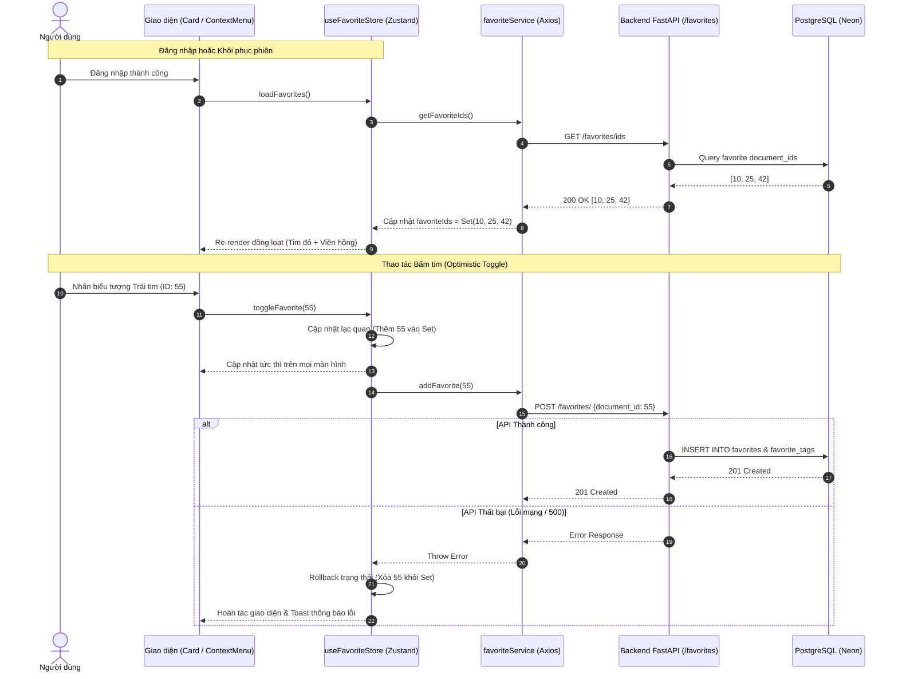

# Tài liệu Chức năng: Yêu thích (Favorites) & Quản lý Tri thức Cá nhân

## 1. Mục tiêu và Phạm vi
Chức năng **Tài liệu yêu thích (Favorites)** được nâng cấp từ tính năng đánh dấu bookmark đơn giản thành công cụ quản lý tri thức cá nhân mạnh mẽ (Personal Knowledge Management - PKM) cho người dùng trong Thư viện số.

### Phạm vi chức năng (Giai đoạn 1):
- **Đánh dấu / Bỏ yêu thích:** Thao tác tức thời từ mọi nơi (Trang Tài liệu, Trang Chi tiết, Menu ngữ cảnh, Trang Yêu thích) với cập nhật lạc quan (optimistic update).
- **Nhận diện trực quan:** Hiển thị biểu tượng trái tim đỏ đặc và viền màu hồng/đỏ nhạt xung quanh thẻ tài liệu đã yêu thích (hỗ trợ cả Dark/Light mode).
- **Quản lý tiến độ đọc:** Phân loại tài liệu theo 3 trạng thái: `to_read` (Đọc sau), `reading` (Đang đọc), `completed` (Đã đọc).
- **Ghi chú cá nhân (Notes):** Lưu trữ tóm tắt, nhận xét hoặc trích dẫn cá nhân lên tới 5000 ký tự.
- **Hệ thống thẻ yêu thích (Favorite Tags):** Gắn/gỡ thẻ phân loại riêng tư cho tài liệu yêu thích (tối đa 10 thẻ/tài liệu), tự động gợi ý (autocomplete) và xử lý trùng tên thông minh.
- **Thống kê & Lọc linh hoạt:** Thống kê tổng số và theo từng trạng thái; hỗ trợ lọc theo trạng thái đọc, lọc theo thẻ (chế độ `any` hoặc `all`), tìm kiếm nhanh và chuyển đổi giao diện Lưới (Grid) / Danh sách (List).

---

## 2. Kiến trúc Hệ thống

### 2.1. Luồng dữ liệu và Đồng bộ Trạng thái (Mermaid Diagram)

### 2.2. Các thành phần chính

1. **Backend:**
   - **Models:** `Favorite` (chứa `reading_status`, `notes`), `FavoriteTag` (bảng liên kết nhiều-nhiều giữa favorites và tags).
   - **Schemas:** `FavoriteCreate`, `FavoriteUpdate`, `FavoriteOut`, `FavoriteDocumentOut` (kế thừa đầy đủ `DocumentOut`), `FavoriteListOut`, `FavoriteStatsOut`, `FavoriteTagOut`.
   - **Router:** `backend/app/routers/favorites.py` cung cấp đầy đủ các REST endpoint xác thực theo `current_user.id`.

2. **Frontend Store:**
   - `useFavoriteStore`: Quản lý tập `favoriteIds: Set<number>`, cung cấp `isFavorite(id)`, `toggleFavorite(id)` với optimistic update và rollback khi gặp lỗi, tích hợp vào chu kỳ sống của ứng dụng (`useRestoreSession`, `authStore`).

3. **Frontend Components:**
   - `FileDocumentCard` / `BundleDocumentCard`: Nhận biết trạng thái yêu thích từ store, hiển thị tim đỏ và viền nhận diện `border-rose-300 ring-1 ring-rose-200`.
   - `DocumentContextMenu`: Tự động chuyển đổi nhãn `Thêm vào Yêu thích` / `Bỏ yêu thích` kèm icon tim tô màu.
   - `DocumentListView`: Hỗ trợ hiển thị dạng bảng danh sách với tim đỏ, viền dòng highlight và menu chuột phải.
   - `FavoritesPage`: Tái sử dụng `DocumentCard` và `DocumentListView` hiển thị đầy đủ thông tin tệp tin giống trang Tài liệu, tích hợp các bộ lọc và popup quản lý tiến độ, ghi chú, gắn thẻ.

---

## 3. Quy tắc Nghiệp vụ Chung

- **Quyền riêng tư:** Mọi dữ liệu yêu thích, tiến độ đọc, ghi chú và thẻ yêu thích là riêng tư của từng người dùng. User A không thể xem hoặc sửa dữ liệu của User B.
- **Tài nguyên của người khác:** Trả về `404 Not Found` (thay vì 403) khi truy cập tài liệu không thuộc quyền xem.
- **Trạng thái đọc:** Chỉ nhận 1 trong 3 giá trị: `'to_read'` (mặc định), `'reading'`, `'completed'`.
- **Giới hạn thẻ:** Mỗi tài liệu yêu thích được gắn tối đa **10 thẻ**.
- **Gỡ thẻ:** Thao tác gỡ thẻ khỏi tài liệu yêu thích chỉ xóa dòng liên kết trong bảng `favorite_tags`, **không bao giờ xóa thẻ gốc** trong bảng `tags`.
- **Xử lý trùng tên thẻ:** Tự động loại bỏ ký tự `#` ở đầu, trim khoảng trắng, so sánh không phân biệt hoa thường và ưu tiên gán thẻ có `id` nhỏ nhất nếu đã tồn tại.
- **Tự động Cascade:** Khi tài liệu hoặc người dùng bị xóa, cơ sở dữ liệu tự động kích hoạt `CASCADE` dọn dẹp các bản ghi yêu thích và thẻ liên quan.
